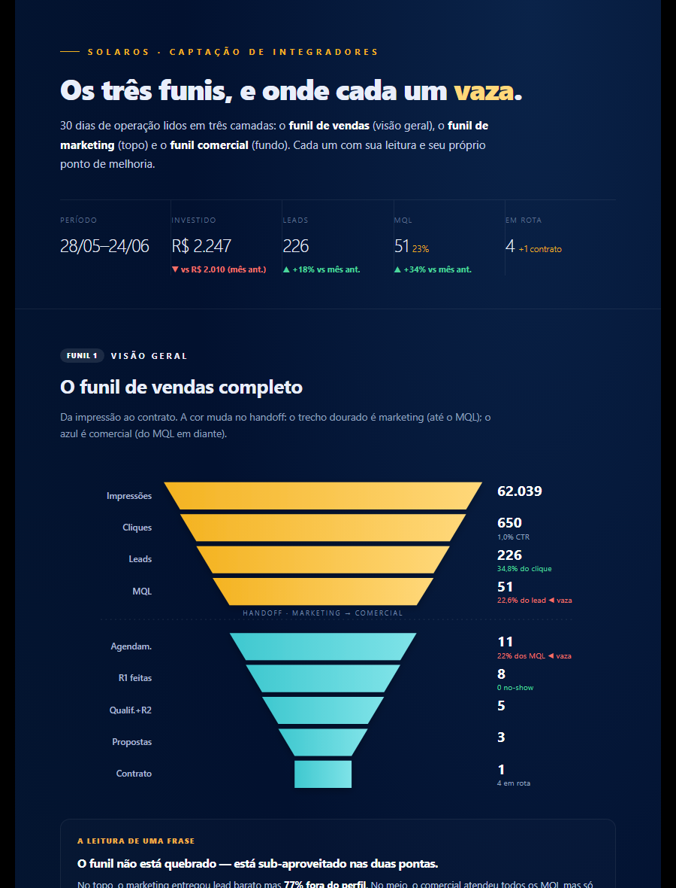
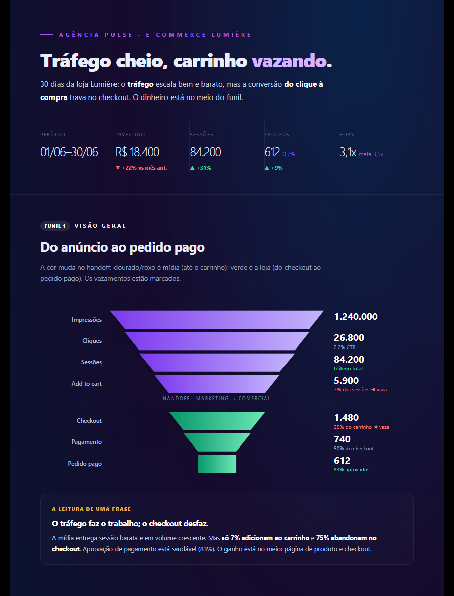
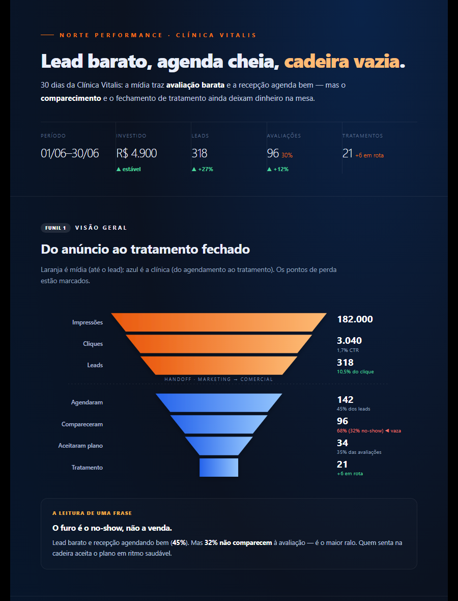
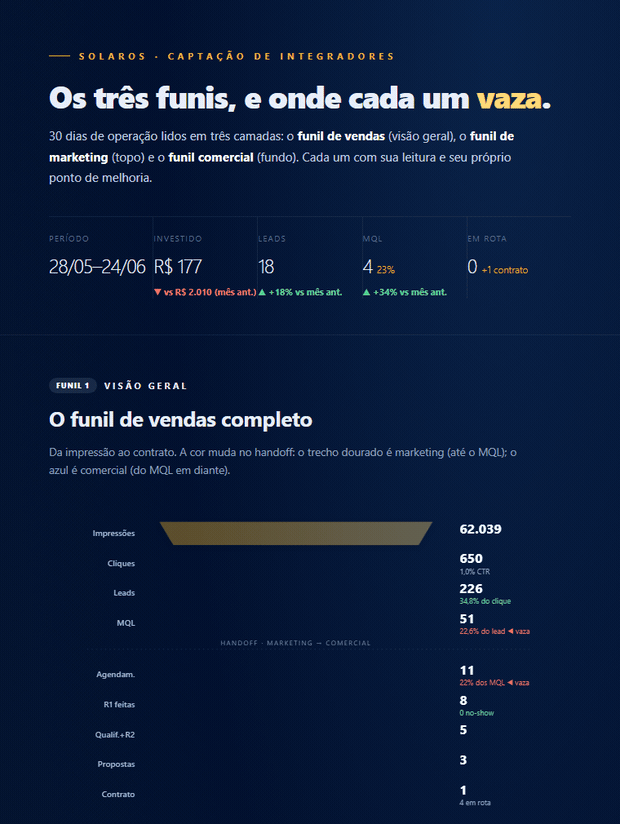

# A Ordem — Relatórios de Funil

> Grupo de **Agent Skills** (formato `SKILL.md`) para Claude Code / Cursor que gera
> **relatórios visuais de funil** para agências — dos 3 funis (vendas, marketing,
> comercial) a um HTML animado, com a marca do cliente.
> Feito pela **A Ordem**.

---

## O que é

Skills que rodam dentro do Claude Code (ou Cursor) e transformam dados de campanha
e comercial num **relatório bonito, animado e auto-contido** (um arquivo HTML que
abre offline). Você pede em linguagem natural ("monta o relatório de funil do
cliente X") e o agente coleta os números (Meta/Business Manager + CRM, ou manual),
faz a leitura do funil e renderiza o relatório com a identidade visual da marca.

São **3 skills**: **coletar dados → gerar relatório** (+ `relatorio-meta`, versão
paste-based rápida só de mídia).

## Preview

Três exemplos com dados e **paletas diferentes** (a marca define as cores). Veja os
relatórios completos em [`examples/`](examples/) — abra os `.html` para a versão animada.

| SolarOS (navy + ouro) | Lumière (roxo + verde) | Vitalis (laranja + azul) |
|:---:|:---:|:---:|
|  |  |  |
| captação B2B | e-commerce de moda | clínica / saúde |

> Prints do topo (header + funil de vendas). Página inteira em
> `examples/previews/relatorio-*.png`.

### Animação



Tudo nativo (CSS + JS vanilla, sem libs): os números fazem *count-up* e o funil
cresce em cascata ao carregar. Respeita `prefers-reduced-motion` e tem `--no-anim`
para PDF/impressão.

### Tipos de relatório

O **mesmo `dados.json`** gera formatos diferentes — escolha com `--tipo` (ou o campo
`"tipo"` no JSON) para o relatório não sair sempre igual. Detalhes em
[`tipos.md`](.claude/skills/gerar-relatorio-funil/references/tipos.md).

| Tipo | Para quê |
|------|----------|
| `completo` | Diagnóstico cheio (padrão) — 3 funis + R$ + tabelas |
| `executivo` | 1 página para o dono/decisor |
| `midia` | Reunião com o gestor de tráfego (só marketing) |
| `comercial` | Reunião com o time de vendas (só comercial) |
| `performance` | Foco em ROI/retorno em R$ |
| `semanal` | Acompanhamento rápido |

```bash
python .claude/skills/gerar-relatorio-funil/scripts/build_report.py \
  examples/dados-exemplo.json --tipo executivo -o relatorio.html
```
Exemplos de cada tipo em [`examples/tipos/`](examples/tipos/).

## Por que existe

Agência boa entrega resultado — mas quase nunca **mostra** isso de forma clara.
Relatório feito na mão é lento e inconsistente; dashboard de ferramenta é genérico
e não conta a história. Estas skills produzem, sempre no mesmo padrão, um relatório
que mostra **onde o funil vaza** e **o que fazer** — pronto para enviar ao cliente.

## Pra quem é

- **Agências de marketing/tráfego** que querem relatórios de cliente padronizados.
- **Gestores de tráfego e closers** que precisam ligar mídia (Meta) a vendas (CRM).
- **Donos de agência** que querem provar resultado e orientar o próximo passo.

## As skills

### `coletar-dados-funil`
Reúne os números dos 3 funis. Puxa **marketing** do Meta/Business Manager via Graph
API (`meta_fetch.py`) e o **comercial** do CRM (export CSV universal via
`crm_csv.py`, ou API). Sem BM e/ou CRM, coleta **manualmente pelo chat**. Ensina o
usuário a obter cada credencial (`references/credenciais.md`).

### `gerar-relatorio-funil`
Monta o `dados.json` (números + análise), aplica a **marca** (logo + cores,
opcional) e renderiza o HTML com `build_report.py`: funis em SVG **animados**,
count-up de números, cards de risco/força, pipeline de deals e plano de ação.

### `relatorio-meta`
Versão **paste-based** (cola no Claude/ChatGPT, zero credencial): a agência cola as
métricas do Meta e recebe um **relatório executivo** de mídia em texto. Alternativa
rápida ao relatório visual completo, para quando não vai montar o `dados.json`.

## Início rápido

```bash
# 1) Clona o repo numa pasta de trabalho
git clone https://github.com/<voce>/ordem-relatorios.git
cd ordem-relatorios

# 2) Abre o Claude Code aqui dentro — as skills em .claude/skills são detectadas
claude
> monta o relatório de funil do cliente X (Meta + CRM)
```

Para as skills ficarem disponíveis em qualquer projeto, copie `.claude/skills/*`
para `~/.claude/skills/` (Claude Code) ou `~/.cursor/skills/` (Cursor).

### Dependências
- `meta_fetch.py` usa `requests` (`pip install -r .claude/skills/coletar-dados-funil/scripts/requirements.txt`).
- `crm_csv.py` e `build_report.py` usam **só a biblioteca padrão** do Python — nada a instalar.

## Animação

O relatório é animado **sem nenhuma biblioteca externa** (CSS + um `<script>` vanilla
embutido): os funis crescem com efeito em cascata, os números fazem *count-up* e as
seções surgem ao rolar — tudo respeitando `prefers-reduced-motion` (acessibilidade)
e com fallback estático para impressão/PDF (`--no-anim`). Mantém o princípio de
"um arquivo só, portátil, offline". (Skills de animação externas — ex.
`delphi-ai/animate-skill`, `freshtechbro/claudedesignskills` — não são necessárias
aqui; se um dia quiser efeitos mais elaborados, dá pra plugar.)

## Por que essa arquitetura é diferente

**1. Tudo em arquivos comuns. Sem banco de dados.**
Markdown, JSON e Python puro; o relatório é um único HTML. Portátil (cabe num
e-mail), auditável (cada número e cada análise é um arquivo) e reversível
(`git revert`).

**2. O número é separado da narrativa.**
Os scripts coletam e desenham (mecânico e determinístico); o agente faz a leitura
do funil, os cards e o plano (juízo). Você troca a análise sem mexer no código.

**3. O dado manda — e quando falta, é honesto.**
Cenário ideal é BM + CRM juntos (atribuição lead→venda). Faltou? Entrada manual, e o
que não existe vira "—" no relatório, nunca número inventado.

**4. Marca do cliente, sem dependência.**
Logo + cores entram por configuração; o HTML é auto-contido e abre offline.

## Estrutura de pastas

```
ordem-relatorios/
├── README.md · LICENSE · .gitignore
├── examples/            # dados-exemplo.json + relatorio-exemplo.html (gerado)
├── tests/               # testes do gerador (sem rede)
├── templates/workspace/ # layout de trabalho + .env.example
└── .claude/skills/
    ├── coletar-dados-funil/
    │   ├── SKILL.md
    │   ├── references/ (credenciais, meta-ads, crm, manual, metricas)
    │   └── scripts/    (meta_fetch.py, crm_csv.py, requirements.txt)
    └── gerar-relatorio-funil/
        ├── SKILL.md
        ├── references/ (estrutura-dados, branding, metricas)
        └── scripts/    (build_report.py)
```

## O que isso NÃO é

- Não é uma ferramenta de mídia/CRM — **lê** desses sistemas, não os substitui.
- Não é um serviço em nuvem — roda local, no seu agente; o relatório abre offline.
- Não inventa número — sem dado, mostra "—".

## Feito pela A Ordem

Criado e mantido pela **A Ordem**. Skills feitas para agências de marketing/tráfego.
Licença MIT (ver `LICENSE`).
